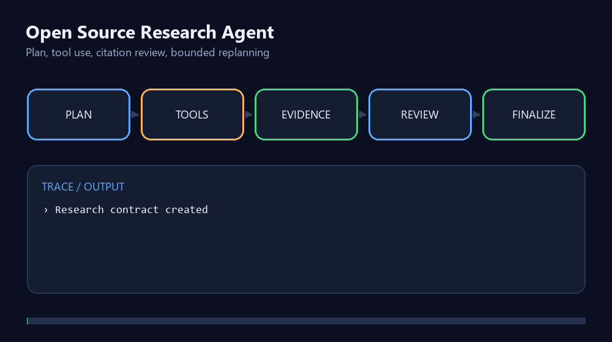

# Open Source Research Agent

[](https://github.com/coolwkx/open-source-research-agent/actions/workflows/ci.yml)
[](https://github.com/coolwkx/open-source-research-agent/releases)
[](LICENSE)

一个面向开源项目调研的轻量 Agent：先制定证据采集计划，再调用工具读取项目资料，对引用和任务覆盖度进行审查，必要时重规划，最后生成带证据编号的报告。

> 本仓库是独立 clean-room 作品，不包含任何公司代码、内部数据、私有提示词或生产凭据。



查看：[完整架构说明](docs/ARCHITECTURE.md) · [中文面试讲解材料](docs/INTERVIEW_GUIDE.md)

作品集导航：[Browser Runtime](https://github.com/coolwkx/browser-agent-runtime-lite) · [Agent Eval Lab](https://github.com/coolwkx/agent-eval-lab) · **Research Agent**

## 在整套 Agent 工程中的位置

本仓库负责“**场景应用**”：把规划、只读工具、证据引用、Reviewer 和有限重规划组合成开源项目调研 Agent。[Browser Runtime](https://github.com/coolwkx/browser-agent-runtime-lite) 展示底层可靠性机制，[Agent Eval Lab](https://github.com/coolwkx/agent-eval-lab) 负责验证输出是否真正完成目标。

## 为什么做这个项目

普通搜索脚本只负责“找到内容”，但 Agent 还需要回答三个问题：目标是否真的完成、结论是否有证据、工具失败后是否能安全恢复。本项目用可测试的状态和接口演示这些能力。

## Agent 工作流

```text
ResearchTask
    ↓
PLAN → ACT(tool) → VERIFY(reviewer)
          ↑              ↓
          └── REPLAN ────┘
                         ↓
                      FINALIZE
```

- **Task Contract**：定义项目、必需字段、工具和重规划预算；
- **Tool Calling**：通过可注入工具校验任务中显式指定的目标，并读取结构化资料；默认使用离线 fixture，也可选择 GitHub 公共只读适配器；
- **Evidence Grounding**：每条结论绑定证据 ID 与来源；
- **Reviewer**：检查缺失字段和引用 ID 完整性，拒绝“看似完成”；
- **Bounded Replanning**：瞬时失败后有限重试，预算耗尽则输出 `PARTIAL/BLOCKED`；
- **Trajectory**：记录 PLAN、ACT、VERIFY、REPLAN、FINALIZE 事件。

## 快速运行

需要 Node.js 22 及以上版本。

```bash
npm ci
npm run check
```

默认演示完全离线，不需要 API Key，也不会访问真实账号。结果写入 `reports/demo-result.json`，该文件默认不提交。

预期输出示例：

```text
状态：COMPLETED
证据：8 条；工具调用：4；重规划：1
阶段：PLAN → ACT → PLAN → REPLAN → ACT → ACT → VERIFY → FINALIZE
```

### 可选：读取真实 GitHub 公共仓库

```bash
npm run demo -- --mode=github --projects=octocat/Hello-World,nodejs/node
```

该模式只读取 GitHub 公共 REST API 的仓库元数据，**不需要 Token**，结果写入 `reports/github-demo-result.json`。项目参数只接受 `owner/repo`、`https://github.com/owner/repo` 或对应的 `https://api.github.com/repos/owner/repo`；其他域名、HTTP、查询参数和非仓库路径会在发起网络请求前被拒绝。

GitHub 适配器的安全边界：

- 请求地址由适配器生成，目标只能是 `api.github.com/repos/{owner}/{repo}`；
- 只暴露读取接口，请求方法固定为 `GET`，不读取或发送 Token；
- 使用固定 `User-Agent`、8 秒默认超时、`AbortSignal` 和 256 KiB 默认响应上限；可配置值仍被限制在 60 秒和 2 MiB 以内；
- 区分 404、限流、超时、调用方取消、服务端故障、非法目标和异常响应；
- 测试全部使用 mock `fetch`，不会依赖真实网络。

## 设计边界

- 默认使用本地 fixture，目的是保证演示与测试可重复；GitHub 模式是显式选择的可选路径；
- 当前没有接入真实 LLM；公开版实现了可插拔 `ResearchPlanner`、显式计划版本和策略变化，默认使用确定性 Planner 保证复现；
- GitHub 适配器只读取公开仓库元数据，不读取 README 或源码，不处理登录、验证码、私有仓库或凭据；
- GitHub 模式受公共 API 限流和网络状态影响，没有缓存、重试退避或生产级可用性承诺；
- 演示结果不是线上性能或实际业务收益。

> 这是用于展示 Agent 工具抽象、证据链和安全边界的非生产实现，不应直接作为通用 GitHub 客户端或生产数据采集服务。

## 后续计划

- 为公开元数据增加可验证缓存、退避和来源时效策略；
- 增加可插拔 Model Adapter，让 Planner 可由结构化模型输出驱动；
- 增加来源时效、冲突证据和可信度评估；
- 使用公开、可复现任务集评估报告正确率和引用覆盖率。

## 安全与贡献

请阅读 [SECURITY.md](SECURITY.md) 和 [CONTRIBUTING.md](CONTRIBUTING.md)。本项目采用 [MIT License](LICENSE)。
