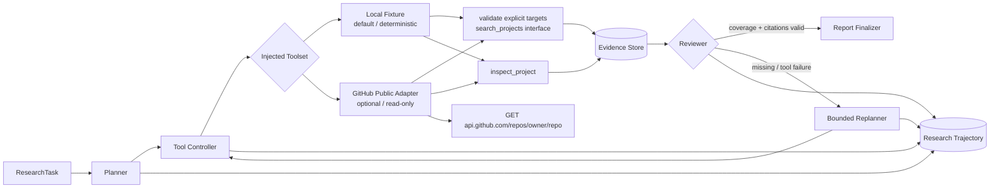
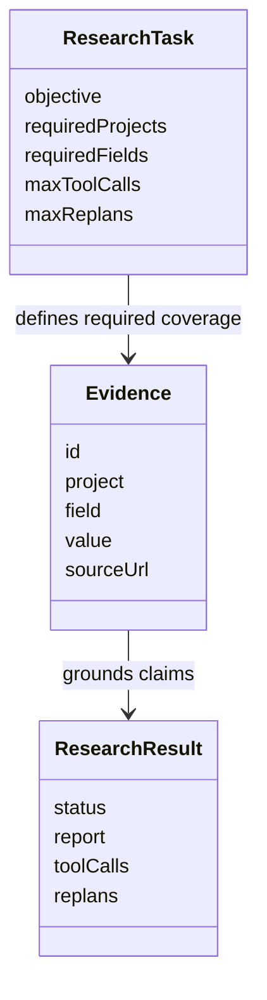
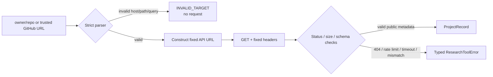

# 架构说明

## 核心数据关系

## 工具注入与执行模式

`runResearchAgent` 依赖 `ResearchToolset` 接口，而不是绑定具体数据源：

- `LocalResearchTools` 是默认实现，读取确定性 fixture，保证 CI 和演示可重复；
- `GitHubPublicResearchTools` 是显式启用的可选实现，只读取公开仓库 REST 元数据；
- 两个实现产生同一种 `ProjectRecord`，因此 Planner、Evidence Store、Reviewer 和报告生成无需感知数据源；
- `ResearchRunOptions.signal` 会沿 Agent 调用链传给工具与 Planner context；每个异步阶段返回后和最终审查前都会再次检查，避免把已取消运行误报为正常结果。

## GitHub 适配器信任边界

适配器没有通用 URL 请求入口，也没有创建、修改或删除资源的方法。它只接受 `github.com` 与 `api.github.com` 的规范 HTTPS 仓库地址，随后重新构造 `api.github.com/repos/{owner}/{repo}`。响应中的仓库身份必须与请求目标一致，来源 URL 也由适配器生成，避免服务端字段把证据链指向其他域名。

网络读取具有固定 User-Agent、8 秒默认超时、调用方 AbortSignal、禁止重定向和 256 KiB 默认响应上限。错误分类用于控制恢复策略，但当前版本没有缓存、指数退避或生产级速率协调。

## 可信完成条件

完成不仅要求生成报告，还要求每个目标项目的必需字段都有证据，并且报告引用的 Evidence ID 均存在。任务入口会按大小写和 GitHub 规范身份拒绝重复目标，证据合并时也会拒绝重复 Evidence ID，避免同一引用指向两份记录。该检查保证的是**引用完整性**，不等价于独立证明外部来源真实。瞬时工具失败会生成新版本计划并改变步骤策略；调整只允许在 `maxReplans` 内进行，预算耗尽后输出 PARTIAL 或 BLOCKED。

GitHub 模式把公共 API 元数据作为工具证据，但仍不证明仓库描述本身绝对正确，也不代表已经阅读或理解源码。
