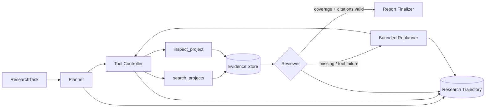
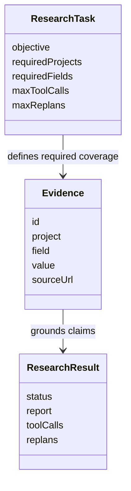

# 架构说明

```mermaid
flowchart LR
    Q[ResearchTask] --> P[Planner]
    P --> C[Tool Controller]
    C --> S[search_projects]
    C --> I[inspect_project]
    S --> E[(Evidence Store)]
    I --> E
    E --> V{Reviewer}
    V -->|coverage + citations valid| F[Report Finalizer]
    V -->|missing / tool failure| R[Bounded Replanner]
    R --> C
    P --> T[(Research Trajectory)]
    C --> T
    V --> T
    R --> T
```

## 核心数据关系

```mermaid
classDiagram
    class ResearchTask {
      objective
      requiredProjects
      requiredFields
      maxToolCalls
      maxReplans
    }
    class Evidence {
      id
      project
      field
      value
      sourceUrl
    }
    class ResearchResult {
      status
      report
      toolCalls
      replans
    }
    ResearchTask --> Evidence : defines required coverage
    Evidence --> ResearchResult : grounds claims
```

## 可信完成条件

完成不仅要求生成报告，还要求每个目标项目的必需字段都有证据，并且报告引用的 Evidence ID 均存在。该检查保证的是**引用完整性**，不等价于独立证明外部来源真实。瞬时工具失败会生成新版本计划并改变步骤策略；调整只允许在 `maxReplans` 内进行，预算耗尽后输出 PARTIAL 或 BLOCKED。
